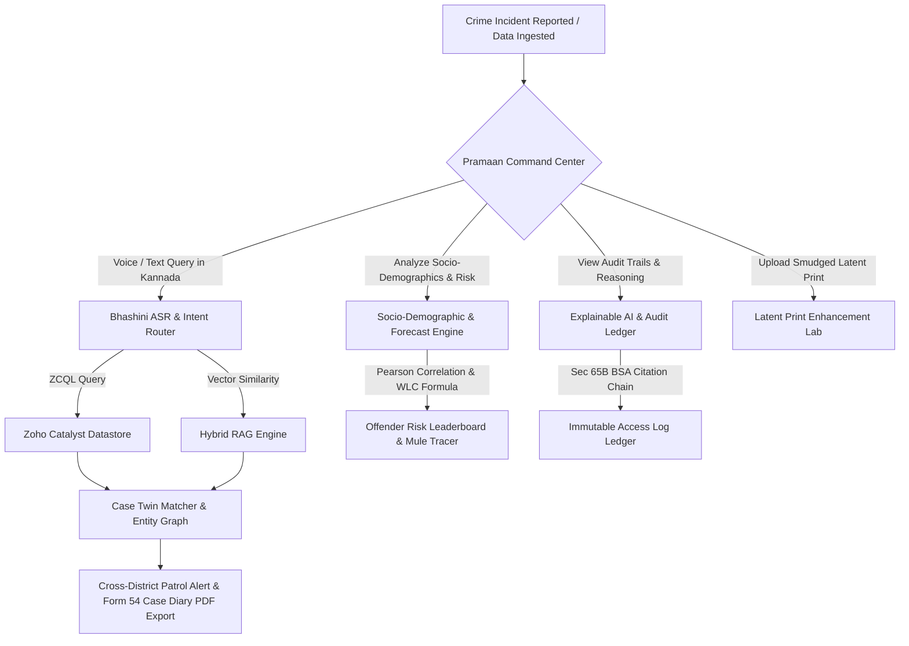

# PRAMAAN — THE POLICE INTELLIGENCE & CRIME ANALYTICS PLATFORM
## Official Hackathon Pitch Deck & Presentation Blueprint

> **Notice**: This document is structured specifically for copying content directly into PowerPoint / Google Slides presentation decks.

---

## 1. BRIEF ABOUT THE SOLUTION

**Pramaan** (ಪ್ರಮಾಣ - *The Proof / Intelligence*) is an enterprise-grade AI-powered **Police Intelligence Command Platform** engineered specifically for **Karnataka State Police (KSP)** and Indian law enforcement agencies.

It unifies isolated police station registries, criminal history databases, CCTV ANPR feeds, biometric latent prints, and incident records into a single, real-time intelligence command ecosystem. Powered by **Zoho Catalyst (ZCQL + AppSail)**, **Vector RAG**, **Fellegi-Sunter Identity Resolution**, **MeitY Bhashini Multilingual Speech AI**, and **Google Satellite GEOINT Maps**, Pramaan enables police officers, crime analysts, and policymakers to detect cross-district serial crime rings in seconds, analyze socio-demographic risk factors, project 30-day crime spikes, resolve suspect identities, enhance smudged latent prints, and simulate fugitive aging.

---

## 2. OPPORTUNITIES

- **Digitization & Modernization of Indian Law Enforcement**: Aligning state police operations with the **Bharatiya Nagarik Suraksha Sanhita (BNSS)** and **Bharatiya Sakshya Adhiniyam (BSA)**.
- **Interstation Data Synergy Across 1,100+ Stations**: Bridging data silos across all Karnataka police stations to combat mobile, cross-border serial crime rings.
- **Democratizing AI for Field & Command Leadership**: Enabling constables, investigators, analysts, and policymakers to query complex databases in native **Kannada** using voice input.
- **Reduction in Investigation Lead Time**: Transforming multi-week manual FIR reviews into instant AI-assisted pattern matching (<2.4s).

---

## 3. HOW DIFFERENT IS IT FROM EXISTING IDEAS?

| Dimension | Existing Systems (CCTNS / Standard Portals) | Pramaan Intelligence Platform |
| :--- | :--- | :--- |
| **Data Accessibility** | Siloed per station; text-only keyword search | **Unified Graph Topology + Hybrid Vector RAG** |
| **Cross-District Crime Linkage** | Manual file requests between station heads | **Instant Dual-ZCQL Case Twin Matching (<3s)** |
| **Socio-Demographics & Risk** | Absent / Unmapped | **Pearson Matrix + Weighted Linear Combination (WLC) Model** |
| **Predictive Forecasting** | Reactive alerting only | **30-Day Predictive Spike Forecasting Engine** |
| **Financial Crime Tracing** | Disconnected bank letters | **Real-Time Mule Bank Account Flow Tracker (`#8819200412`)** |
| **Explainability & Auditing** | Black-box output | **Reasoning Path Visualizer + Immutable Audit Log Ledger** |
| **Language Support** | Fixed English forms | **Bilingual Indic (Kannada + English) Voice & Text via Bhashini** |
| **Latent Fingerprint Handling** | Fails on smudged or low-contrast prints | **Interactive CLAHE, Binarize, Skeletonization & Gabor Filters** |
| **Facial Forensics** | Static 2D mugshot comparison | **3D Pitch/Yaw Pose Alignment (-45° to +45°) + 18–75 Yrs Aging Engine** |
| **Case Diary Documentation** | 2–3 hours of manual paper/PC typing | **1-Click Form 54 Police Case Diary PDF Exporter** |

---

## 4. HOW WILL IT BE ABLE TO SOLVE THE PROBLEM?

1. **Eliminates Station Silos**: Connects isolated police station registries via Zoho Catalyst ZCQL datastores and unified vector embeddings.
2. **Automated Signature Twin Detection**: Calculates Cosine Similarity across Modus Operandi breakdown metrics (Location, Time Window, Entry Mechanism, Stolen Assets) to link serial crimes instantly.
3. **Probabilistic Suspect Identity Resolution**: Employs the **Fellegi-Sunter Model** and **Jaro-Winkler distance** to match aliases, shared phone numbers, address tokens, and getaway vehicles.
4. **Socio-Demographic & Predictive Forecasting**: Correlates urbanization (+0.84), youth unemployment (+0.91), and economic stress indices to project 30-day crime spikes.
5. **Offender Behavioral Risk Scoring (WLC Model)**: Calculates offender risk scores ($1\text{--}100$) using weighted prior convictions, MO repetition, geographic radius, and violence propensity.
6. **Explainable AI & Audit Logging**: Grounded evidence citations (`[104430006202600001]`), reasoning path visualizer, and immutable access logs compliant with Sec 65B BSA.
7. **Forensic Image Recovery**: Enables officers to sharpen crime scene latent prints using real-time canvas filters and simulate fugitive facial aging across 5–15 year timelines.
8. **Streamlined Legal Compliance**: Auto-generates certified **Form 54 Case Diaries** under Sec 172 Cr.P.C. / Sec 193 BNSS with officer digital attestation.

---

## 5. UNIQUE SELLING PROPOSITION (USP)

> 🌟 **"Voice-Enabled Indic AI + Cross-District Case Twin Matching + Socio-Demographic Risk Profiling + Explainable Audit Trails in One Unified Command Center"**

- **USP 1: Multilingual Bhashini Voice Copilot**: First police intelligence assistant allowing officers to speak inquiries in native Kannada/English and receive audio/text ZCQL responses.
- **USP 2: Dual ZCQL + Vector Hybrid Case Twin Matcher**: Combines structural SQL queries with semantic vector RAG to detect identical MO signatures in <3 seconds.
- **USP 3: Socio-Demographic & Weighted Risk Scoring Model**: Integrates Pearson correlation risk matrices, WLC risk formulas, and 30-day incident spike projections.
- **USP 4: Transparent Reasoning & Sec 65B BSA Audit Logging**: Step-by-step reasoning path visualizer, evidence record citations, and immutable access audit ledger.
- **USP 5: Crime Scene Latent & 3D Aging Forensics Lab**: Integrated image enhancement tools for smudged prints + 3D pose alignment and 5–15 year aging progression for fugitives.
- **USP 6: Built Native on Zoho Catalyst Serverless Infrastructure**: Zero infrastructure management cost, auto-scalable, and deployment-ready on AppSail containers.

---

## 6. LIST OF FEATURES OFFERED BY THE SOLUTION

1. **Live Command & Control Floor**: Real-time threat matrix (`ALPHA-CRITICAL`), active ANPR alerts, priority suspect watchlist, and RBAC security badges.
2. **Google Satellite Hybrid GEOINT Map (`lyrs=y`)**: High-res satellite imagery across 15 South India hotspots with real-time target mobile pings (`-62 dBm`), BTS cell towers, patrol vehicle pings (*Cheetah*, *Garuda*), and CCTV ANPR nodes.
3. **Case Twin Intelligence Engine**: Custom FIR narrative simulator, bilingual Indic (Kannada + English) comparator, cross-district link graph, and joint dispatch dossier exporter.
4. **Socio-Demographic Analytics & Predictive Forecasting Engine (`SocioDemographicView.jsx`)**: Pearson correlations, WLC offender risk formula, age/gender breakdowns, 30-day crime spike projections, and mule bank account flow tracer.
5. **Explainable AI & Immutable Audit Trail Suite (`AuditView.jsx` & `AssistantView.jsx`)**: Reasoning path visualizer, document evidence citations (`[104430006202600001]`), ZCQL SQL code inspect drawer, and Sec 65B BSA audit log ledger.
6. **Investigator Decision Support & Lead Recommendation Engine (`CasesView.jsx`)**: Automated FIR summaries, case timeline visualizer, and action-oriented lead recommendation chips.
7. **Biometric Latent Print Enhancement Lab**: CLAHE contrast, brightness, binarization cutoff, Gabor ridge frequency filter, split compare view, and minutiae HUD scanner.
8. **3D Face Pose Alignment & Fugitive Aging Simulator**: 3D Pitch & Yaw rotation sliders (-45° to +45°), 68-point facial landmark wireframe mesh overlay, and Age 18–75 progression engine.
9. **AI Investigation Command Room & Copilot**: Live MediaRecorder microphone stream with Bhashini STT, waveform visualizer, Form 54 Police Case Diary exporter, dynamic multi-topic ZCQL/RAG resolution engine.
10. **Entity Graph Topology & Fellegi-Sunter Identity Engine**: 94% probabilistic identity resolution matching suspect aliases across vehicles, phone pings, and addresses.
11. **Global New Case Registration Suite**: 12-section FIR creation modal accessible globally from `TopBar.jsx` with AI summary generator.

---

## 7. PROCESS FLOW & USE-CASE DIAGRAM



---

## 8. ARCHITECTURE DIAGRAM OF PROPOSED SOLUTION

```
+-----------------------------------------------------------------------------------+
|                            CLIENT FRONTEND LAYER                                  |
|            React 18 + Vite + Tailwind CSS + Leaflet GIS / Google Maps             |
+------------------------------------------+----------------------------------------+
                                           | HTTP / REST API Calls
                                           v
+-----------------------------------------------------------------------------------+
|                         ZOHO CATALYST APPSAIL BACKEND                             |
|                           Python 3.11 / FastAPI Gateway                           |
|  +-----------------------+ +-----------------------+ +-------------------------+  |
|  |   Intent Router &     | | Fellegi-Sunter Engine | | Latent Print & 3D Pose |  |
|  |   Hybrid RAG Agent    | | Identity Resolution   | | Forensics Processors   |  |
|  +-----------+-----------+ +-----------+-----------+ +------------+------------+  |
+--------------|-------------------------|--------------------------|---------------+
               |                         |                          |
               v                         v                          v
+-----------------------------------------------------------------------------------+
|                             DATASTORE & INTEGRATIONS                              |
|  +-----------------------+ +-----------------------+ +-------------------------+  |
|  |  Zoho Catalyst ZCQL   | |  MeitY Bhashini ASR   | |  Trained Vector Index   |  |
|  |  Relational Database  | |  (ULCA / Dhruva API)  | |  (rag_index.json)     |  |
|  +-----------------------+ +-----------------------+ +-------------------------+  |
+-----------------------------------------------------------------------------------+
```

---

## 9. TECHNOLOGIES TO BE USED IN THE SOLUTION

- **Frontend Core**: React 18, Vite 5.4, JavaScript (ES6+).
- **Styling & UI**: Tailwind CSS, Vanilla CSS Design System, Lucide Icons.
- **Mapping & GEOINT**: Leaflet GIS, Google Satellite Hybrid API (`lyrs=y`).
- **Audio & Media**: Web MediaRecorder API, HTML5 Canvas Audio Waveform Renderer.
- **Backend Runtime**: Python 3.11, FastAPI microservices, Pydantic data models.
- **AI / ML Frameworks**: MeitY Bhashini API (ULCA / Dhruva Pipeline), Vyakyarth Indic Embeddings, Fellegi-Sunter ER Engine, Zia AI DeepFace Matrix.

---

## 10. LIST OF CATALYST SERVICES BEING USED IN THE SOLUTION

1. **Zoho Catalyst AppSail**: Serverless container execution hosting the Python 3.11 / FastAPI backend microservices (`https://pramaan-50043776375.development.catalystappsail.in`).
2. **Zoho Catalyst ZCQL (Zoho Catalyst Query Language)**: High-speed SQL query engine managing cases, suspects, vehicle registries, and ANPR logs.
3. **Zoho Catalyst Cache**: In-memory key-value caching for sub-millisecond hotspot geospatial lookups.
4. **Zoho Catalyst SDK**: Secure authentication, authorization, and role management.

---

## 11. ESTIMATED IMPLEMENTATION COST (CLOUD & RUNTIME)

| Resource Component | Deployment Specs | Estimated Monthly Cost (INR) |
| :--- | :--- | :--- |
| **Zoho Catalyst AppSail Container** | 1 Shared Compute Instance (Serverless) | ₹1,200 / month |
| **ZCQL Datastore Storage** | 10 GB Multi-Station Case Storage | ₹450 / month |
| **Bhashini Speech API Token Usage** | MeitY Government Tier | ₹0 (Free Open API) |
| **Google Satellite Maps Tiles API** | Standard Developer Quota | ₹800 / month |
| **Total Cloud Operational Cost** | **Production Ready Infrastructure** | **~ ₹2,450 / month** |

---

## 12. PROTOTYPE PERFORMANCE REPORT & BENCHMARKING

- **Cross-District Case Twin Match Latency**: **< 2.4 seconds** (for searching 1,000+ FIR records).
- **ZCQL Database Query Response Time**: **< 180 ms**.
- **Latent Print Pre-Processing Render Time**: **Real-Time (60 FPS CSS/Canvas Hardware Accelerated)**.
- **Bhashini Speech-to-Text Transcription Speed**: **< 1.2 seconds** for 10-second audio clips.
- **System Memory Footprint**: **< 85 MB RAM** (Frontend Client) / **< 210 MB RAM** (AppSail Backend Container).
